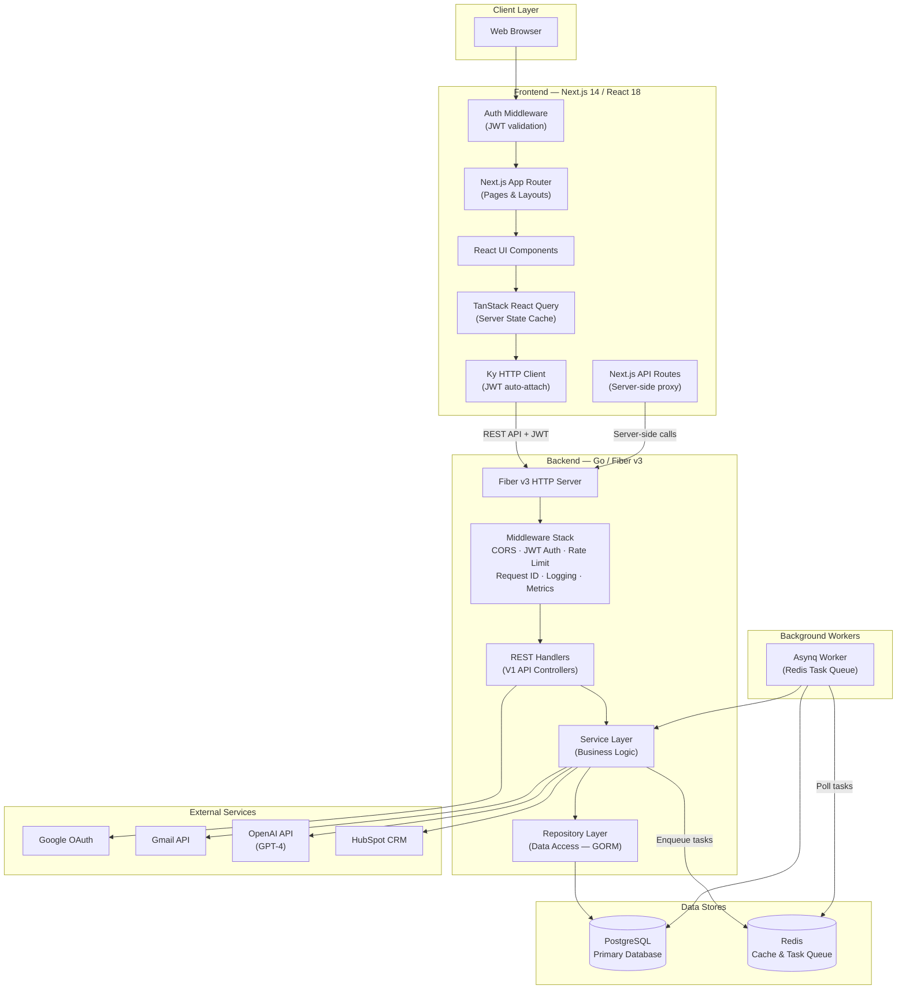
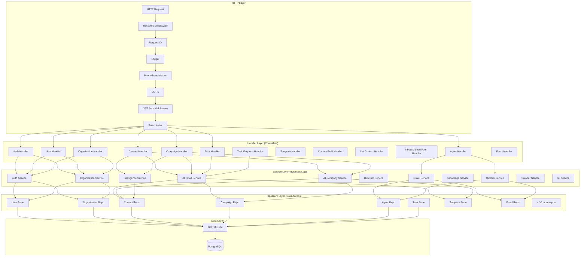
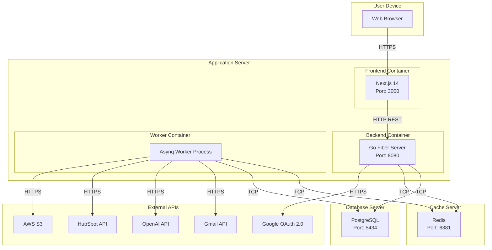
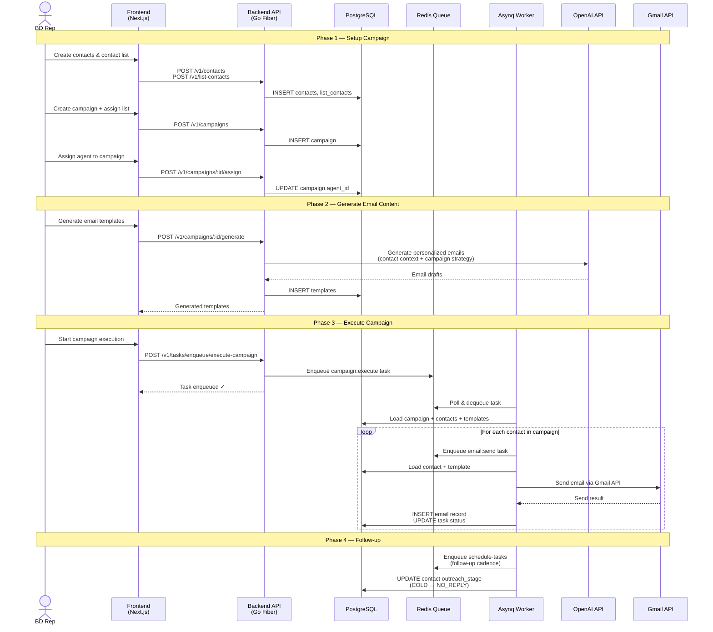
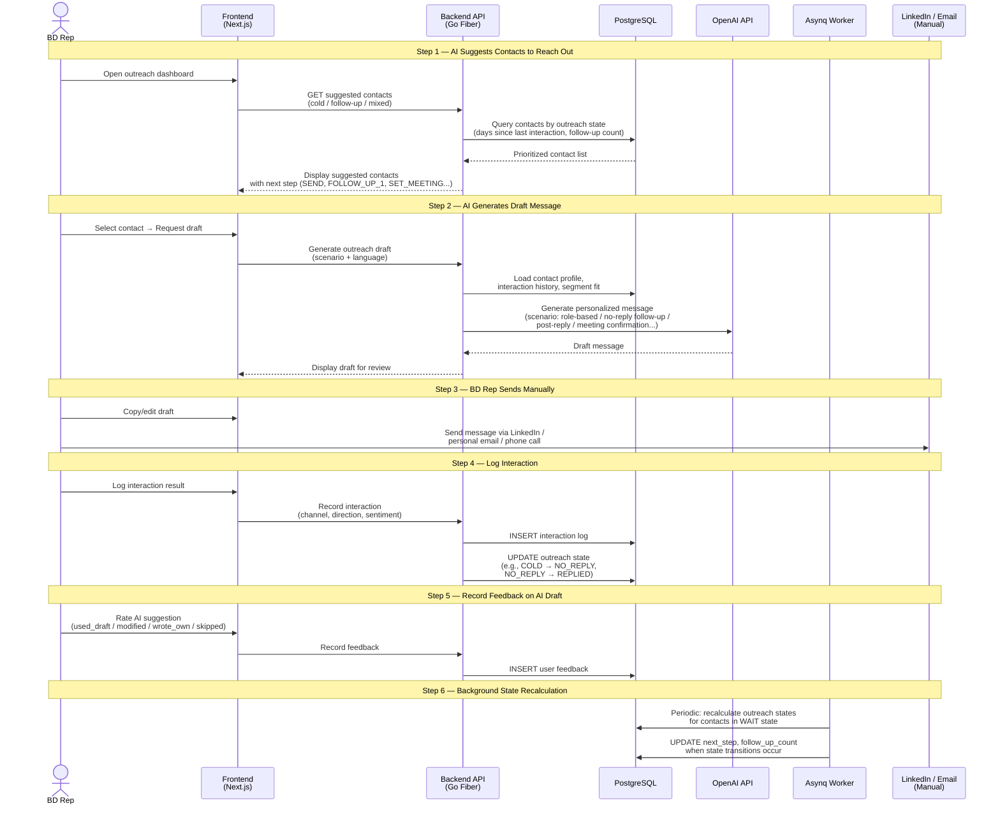
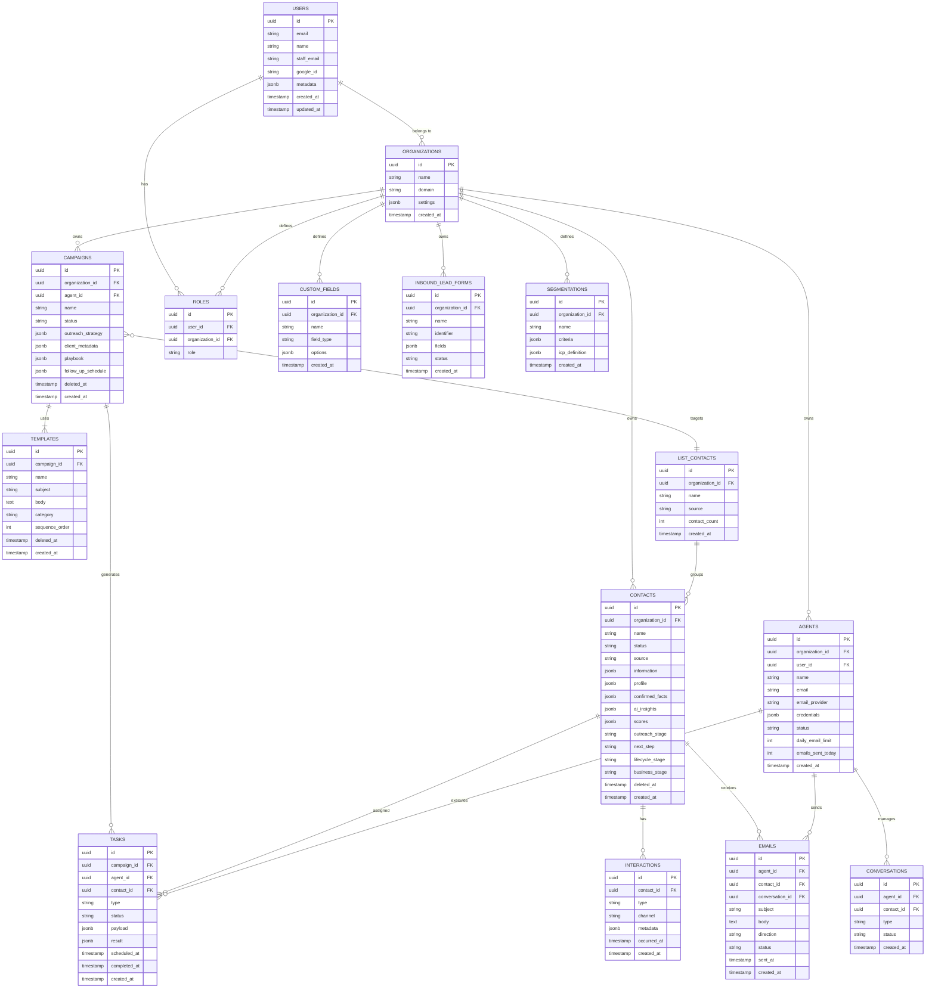
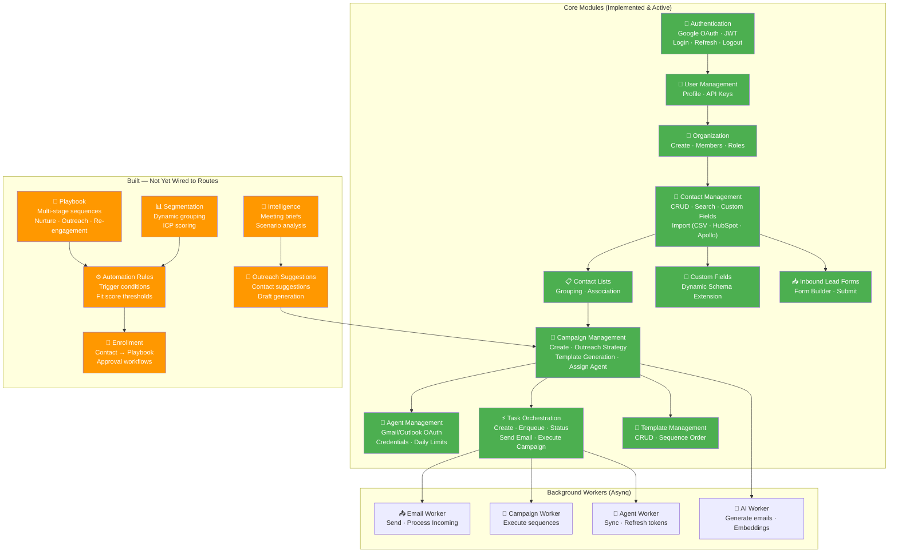
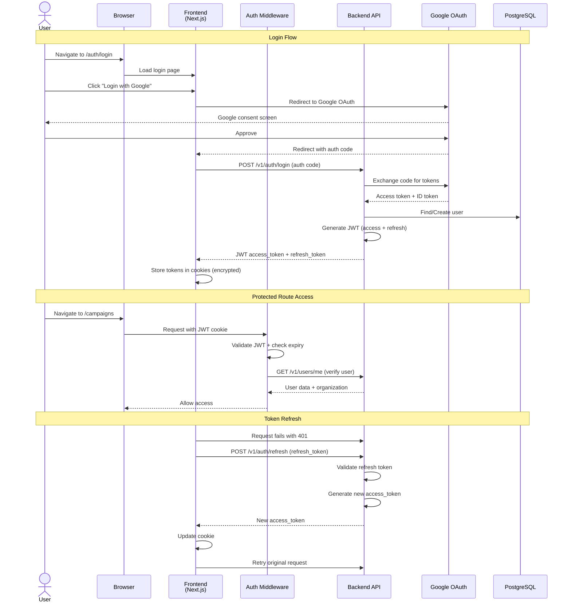
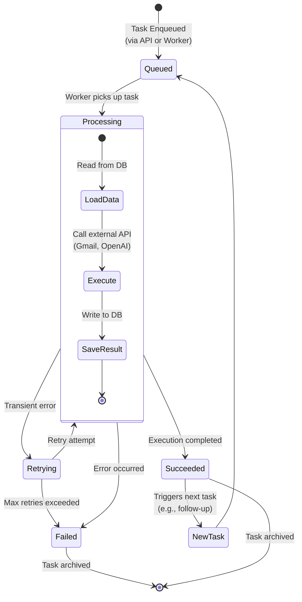

# COSMO System Diagrams

Paste từng block Mermaid vào https://mermaid.live để render thành hình.

---

## 1. System Architecture Overview (Kiến trúc tổng quan)

Diagram này thể hiện kiến trúc client-server tổng thể của COSMO: frontend giao tiếp với backend qua REST API, backend xử lý business logic và đẩy task vào hàng đợi cho background workers thực thi.

**Mô tả:**
- **Client Layer:** Người dùng truy cập hệ thống qua trình duyệt web.
- **Frontend (Next.js 14):** Ứng dụng React sử dụng App Router để định tuyến, TanStack React Query để quản lý server state, và Ky HTTP client tự động gắn JWT token vào mỗi request. Auth Middleware kiểm tra JWT trước khi cho phép truy cập protected routes.
- **Backend (Go/Fiber v3):** REST API server theo kiến trúc phân lớp: Middleware → Handler → Service → Repository → Database. Middleware stack xử lý CORS, xác thực JWT, rate limiting, logging, và metrics.
- **Background Workers:** Asynq worker xử lý async tasks (gửi email, campaign execution, sync agent) từ Redis queue.
- **Data Stores:** PostgreSQL lưu trữ dữ liệu chính, Redis phục vụ caching và task queue.
- **External Services:** Tích hợp Google OAuth (xác thực), Gmail API (gửi/nhận email), OpenAI (sinh nội dung AI), HubSpot (đồng bộ CRM).

---

## 2. Backend Layered Architecture (Kiến trúc phân lớp Backend)

Diagram này thể hiện chi tiết kiến trúc phân lớp bên trong backend, từ HTTP request đến database, theo nguyên tắc separation of concerns.

**Mô tả:**
- **HTTP Layer:** Mỗi request đi qua chuỗi middleware theo thứ tự: Recovery (xử lý panic) → Request ID (gán ID tracking) → Logger (ghi log) → Prometheus (thu thập metrics) → CORS → JWT Auth (xác thực token) → Rate Limiter (giới hạn request/IP).
- **Handler Layer:** 13 handler groups tương ứng với các module chức năng. Mỗi handler parse request, gọi service, và trả response.
- **Service Layer:** Chứa business logic. Các service có thể gọi lẫn nhau và tương tác với external APIs (OpenAI, Gmail, HubSpot).
- **Repository Layer:** 38 repositories cung cấp data access qua GORM ORM, tách biệt hoàn toàn khỏi business logic.
- **Data Layer:** GORM ORM translate Go structs sang SQL queries cho PostgreSQL.

---

## 3. Deployment Diagram (Sơ đồ triển khai)

Diagram này thể hiện cách các thành phần được triển khai trên các node vật lý/container.

**Mô tả:**
- Hệ thống triển khai trên 3 container chính: Frontend (Next.js), Backend API (Go Fiber), và Asynq Worker.
- Frontend chạy trên port 3000, Backend trên port 8080. PostgreSQL dùng port 5434, Redis dùng port 6381 (custom ports để tránh conflict).
- Workers kết nối trực tiếp tới Redis (nhận task) và PostgreSQL (đọc/ghi dữ liệu), đồng thời gọi external APIs để thực thi task (gửi email qua Gmail, sinh nội dung qua OpenAI, đồng bộ CRM qua HubSpot, lưu file qua AWS S3).
- Docker Compose quản lý PostgreSQL và Redis trong môi trường development.

---

## 4a. Automated Email Campaign Flow (Luồng gửi email tự động)

Diagram này thể hiện luồng **tự động**: hệ thống gửi email hàng loạt qua Gmail API và tự động follow-up theo cadence đã cấu hình. Người dùng chỉ cần setup và bấm execute — mọi thứ sau đó do background worker xử lý.

**Mô tả:**
Luồng gửi email tự động gồm 4 phase:
1. **Setup:** BD rep tạo contacts, gom vào contact list, tạo campaign, và gán agent (có Gmail credentials).
2. **Generate:** Hệ thống gọi OpenAI API để sinh email templates cá nhân hóa dựa trên contact context và campaign strategy.
3. **Execute:** Khi BD rep bấm execute, hệ thống enqueue task vào Redis. Asynq worker poll task, load dữ liệu từ DB, và gửi email qua Gmail API cho từng contact. Mỗi lần gửi đều ghi log email record và cập nhật task status.
4. **Follow-up:** Worker tự động schedule follow-up tasks theo cadence đã cấu hình và cập nhật outreach stage của contact.

---

## 4b. Manual Outreach Flow (Luồng outreach thủ công có AI hỗ trợ)

Diagram này thể hiện luồng **thủ công**: AI gợi ý contact cần liên hệ và sinh draft message, BD rep tự gửi qua LinkedIn/email thủ công, rồi log kết quả lại. Hệ thống theo dõi trạng thái outreach và tự động đề xuất bước tiếp theo.

**Mô tả:**
Luồng outreach thủ công gồm 6 bước:
1. **AI Suggest:** Hệ thống gợi ý danh sách contact cần liên hệ, ưu tiên theo trạng thái outreach (cold contacts, contacts cần follow-up) và thời gian kể từ lần tương tác cuối.
2. **AI Draft:** BD rep chọn contact, hệ thống gọi OpenAI sinh draft message cá nhân hóa theo scenario (first outreach, no-reply follow-up, post-reply, meeting confirmation...) và ngôn ngữ (Vietnamese/English).
3. **Manual Send:** BD rep copy/chỉnh sửa draft rồi tự gửi qua LinkedIn, email cá nhân, hoặc gọi điện — hệ thống **không** gửi tự động trong workflow này.
4. **Log Interaction:** BD rep ghi nhận kết quả tương tác (kênh, hướng, sentiment). Hệ thống cập nhật outreach state: COLD → NO_REPLY → REPLIED → POST_MEETING.
5. **Feedback:** BD rep đánh giá chất lượng AI draft (dùng nguyên, sửa, tự viết, bỏ qua) — giúp hệ thống cải thiện gợi ý.
6. **Background Recalculation:** Worker định kỳ tính lại trạng thái outreach cho contacts đang ở trạng thái WAIT, tự động cập nhật next step và follow-up count.

**So sánh 2 workflow:**
| | Automated Campaign (4a) | Manual Outreach (4b) |
|---|---|---|
| **Kênh** | Email (Gmail API) | LinkedIn, email thủ công, phone |
| **Ai gửi?** | Hệ thống tự động | BD rep gửi thủ công |
| **Nội dung** | Email templates sinh hàng loạt | Draft cá nhân hóa per-contact |
| **Follow-up** | Tự động theo cadence | AI gợi ý, BD rep quyết định |
| **Tracking** | Task status (queued→succeeded) | Interaction log + outreach state |

---

## 5. Database ER Diagram (Sơ đồ thực thể - quan hệ)

Diagram này thể hiện các entity chính trong database và mối quan hệ giữa chúng.

**Mô tả:**
- **Organization** là đơn vị multi-tenant chính, sở hữu tất cả dữ liệu (contacts, campaigns, agents).
- **User** thuộc về organization thông qua **Role** (Admin/Member).
- **Contact** lưu profile + AI insights + scoring dưới dạng JSONB, theo dõi outreach_stage (COLD → NO_REPLY → REPLIED → POST_MEETING) và next_step.
- **Campaign** liên kết với ListContact (danh sách mục tiêu), Agent (thực thi), và Templates (nội dung email).
- **Task** là đơn vị thực thi nhỏ nhất: mỗi email gửi, mỗi follow-up đều là 1 task với explicit status (queued → processing → succeeded/failed).
- **Conversation** lưu lịch sử trao đổi giữa Agent và Contact; **Email** lưu từng email cụ thể.
- **Interaction** ghi nhận mọi tương tác (email open, reply, click, LinkedIn accept).
- **Segmentation** phân nhóm contact động theo criteria JSONB.
- **Custom Fields** cho phép mở rộng schema contact mà không cần migration.

---

## 6. Module Component Diagram (Sơ đồ module chức năng)

Diagram này thể hiện các module chức năng của hệ thống và mối liên hệ giữa chúng.

**Mô tả:**
- **Xanh lá (Core Modules):** 11 module đã implement đầy đủ và đang hoạt động — từ Authentication đến Task Orchestration.
- **Cam (Built — Not Wired):** 6 module đã code backend handler nhưng chưa đăng ký routes — bao gồm Playbook (kịch bản tự động), Automation Rules (trigger điều kiện), Enrollment (gán contact vào playbook), Segmentation (phân nhóm), Intelligence (AI insights), và Outreach Suggestions (gợi ý contact + draft).
- **Background Workers:** 4 loại worker xử lý task nền — Email (gửi/nhận), Campaign (thực thi sequence), Agent (sync credentials), AI (sinh nội dung).
- Luồng chính: Auth → User → Org → Contact → List → Campaign → Agent → Task → Workers.

---

## 7. Authentication Flow (Luồng xác thực)

**Mô tả:**
- **Login:** Người dùng chọn "Login with Google" → redirect đến Google OAuth → nhận auth code → backend exchange code lấy token → tạo/tìm user trong DB → trả JWT access/refresh token → frontend lưu vào cookie (mã hóa).
- **Protected Access:** Mỗi request tới protected route, Next.js middleware validate JWT, kiểm tra expiry, và verify user qua backend API.
- **Token Refresh:** Khi access token hết hạn (401), frontend tự động gọi refresh endpoint, nhận token mới, và retry request gốc — người dùng không bị gián đoạn.

---

## 8. Task Orchestration Flow (Luồng điều phối Task)

**Mô tả:**
COSMO sử dụng mô hình task queue để đảm bảo mọi campaign step được thực thi tin cậy:
- **Queued:** Task được tạo qua API (`/v1/tasks/enqueue/*`) hoặc bởi worker khác và đẩy vào Redis queue.
- **Processing:** Asynq worker poll task, load dữ liệu từ DB, gọi external API (gửi email qua Gmail, sinh nội dung qua OpenAI), và lưu kết quả.
- **Succeeded/Failed:** Kết quả được ghi rõ ràng. Task thành công có thể trigger task tiếp theo (ví dụ: gửi email xong → schedule follow-up).
- **Retrying:** Lỗi tạm thời (network timeout, rate limit) được retry tự động. Vượt quá max retries → Failed.
- Mô hình này đảm bảo **traceability** (mọi action đều có log) và **reliability** (retry tự động, không mất task).

---

## 9. Use Case Diagram — Overall (Sơ đồ use case tổng quan)

Mở file `usecase-overall.drawio` bằng https://app.diagrams.net/ hoặc VS Code extension "Draw.io Integration".

**Mô tả:**
Sơ đồ use case tổng quan thể hiện toàn bộ chức năng chính của hệ thống COSMO ở mức module, phân theo 2 phase triển khai.

- **5 Actor:**
  - **Admin** — BD rep có role `admin` trong organization. Có toàn quyền trên hệ thống bao gồm quản lý organization settings, thêm/xóa thành viên, và gán roles. Admin được tự động gán khi tạo organization mới.
  - **BD Rep (Member)** — BD rep có role `member`. Thực hiện được mọi chức năng nghiệp vụ (quản lý contacts, campaigns, agents, outreach) trừ quản lý organization settings và members.
  - **External Visitor** — Người ngoài hệ thống (chưa đăng nhập). Chỉ có thể submit inbound lead form công khai qua public URL.
  - **Background Worker (Asynq)** — System actor hoạt động tự động. Xử lý task queue (gửi email, execute campaign), recalculate outreach state, tính lại segment scores, và execute playbook enrollment stages.
  - **AI Tool Agent (MCP)** — External AI tool gọi API qua Model Context Protocol để tạo campaign kèm contacts trong 1 lần gọi duy nhất.

- **Phase 1 — Core Platform (xanh lá):** 8 use case module đã triển khai đầy đủ với API routes đã đăng ký và frontend UI hoạt động: Authentication & Account, Organization, Contacts & Custom Fields, Contact Lists, Campaigns & Templates, Agents, Task Orchestration, Inbound Lead Forms.

- **Phase 2 — AI-Assisted Outreach (cam):** 6 use case module đã code backend hoàn chỉnh (handlers, services, domain models, database migrations, background workers) chờ kích hoạt API routes: AI Contact Intelligence, AI-Assisted Manual Outreach, Meetings, Segments, Playbook Automation, MCP Integration.

- **Phân quyền:** Admin và Member chia sẻ hầu hết use case. Sự khác biệt duy nhất: chỉ Admin mới được Manage Organization (update settings, manage members & roles). Tất cả các chức năng nghiệp vụ BD khác đều mở cho cả 2 role.
